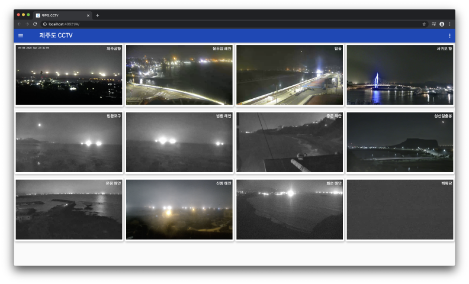

# 🗿 Jejudo CCTV 🎦 WebApp

제주도 멀티뷰 CCTV WebApp.



## TODO

- [X] initialize
- [X] android web browser test
- [X] ios web browser test
- [X] 가비아 도메인 신청(http://jejucctv.site)
- [X] github page에서 cname 설정
- [X] Github Action 스크립트에서 video_player 패키지의 파일을 교체
- [X] 소스코드 SEO 작업
- [ ] naver, google, daum 웹 마스터에 등록
- [ ] google 애널리틱스 등록
- [X] favicon 만들기
- [X] footer 만들기

## 주의

Player 컨트롤러는 기본 기능을 사용한다. 때문에 브라우저에서 제공하는 기본 컨트롤러를 활성화 해야 한다. 문제는 기본 컨트롤러는 disable 상태로 사용자가 직접 활성화를 해야한다. 

이를 해결하기 위해 [```video_player```](https://pub.dev/packages/video_player_web)의 소스코드에서 초기화 부분에서 컨트롤러를 활성화한다.

```
/// $FLUTTER_HOME\.pub-cache\hosted\pub.dartlang.og\video_player_web-0.1.3+2\lib\video_player_web.dart

void initialize() {
  videoElement = VideoElement()
    ..src = uri
    ..style.border = 'none'
    /// 아래 3줄을 추가
    ..autoplay = true
    ..controls = true
    ..volume = 0;
}
```

## Changelog

### 0.0.2

- 16개 채널 동시 시청 가능

### 0.0.1
  
- Hello Flutter on Web
- Github Action을 이용한 deploy

## favicon license

- https://www.crowdpic.net/@N01end
- 
